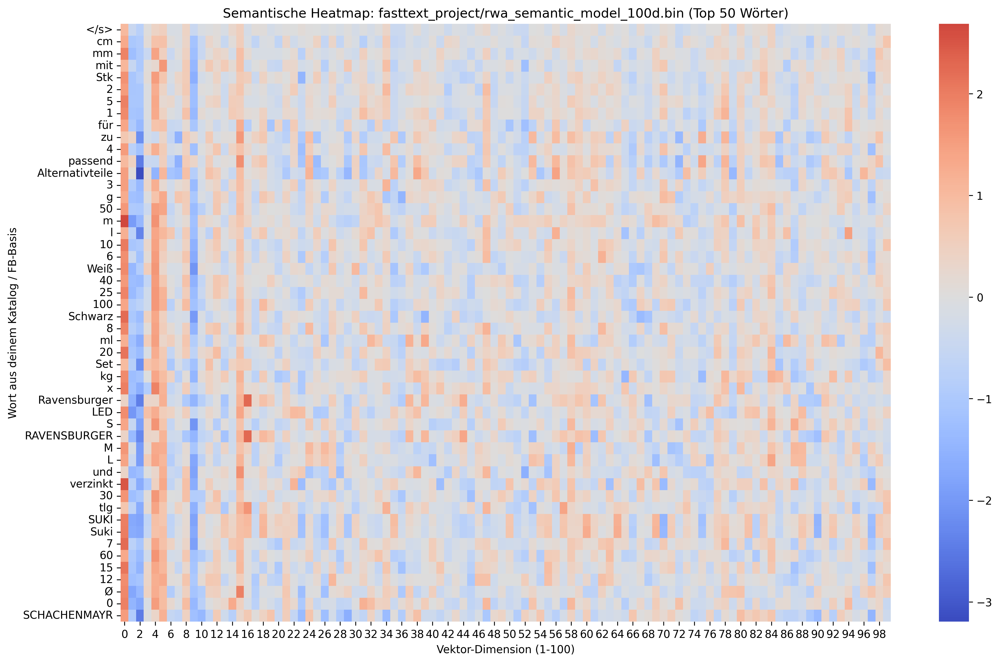
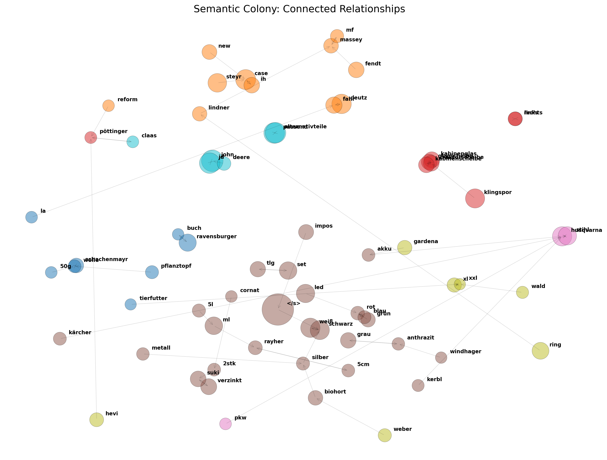

# 🚀 Semantic Search: FastText Model 

Dieses Projekt automatisiert die Erstellung eines domänenspezifischen Wort-Vektor-Modells (100-dimensional) für den RWA-Produktkatalog. Es kombiniert das linguistische Wissen von Facebooks FastText mit den spezifischen Produktdaten aus dem Solr-Index.

---

## 🛠 1. System-Voraussetzungen & Setup

### Python-Umgebung
Das Projekt wurde für **Python 3.9+** optimiert. Um eine saubere Ausführung zu gewährleisten, sollte ein lokaler Interpreter (oder eine Virtual Environment) verwendet werden.

### Erforderliche System-Tools
Stelle sicher, dass `curl` und `gzip` auf deinem System verfügbar sind (auf macOS Standard).

### Installation der Python-Bibliotheken
Führe den folgenden Befehl in deinem Terminal aus, um alle notwendigen Abhängigkeiten für das Training, die API-Kommunikation und die Visualisierungen zu installieren:

```bash
python3.9 -m pip install requests numpy pandas matplotlib seaborn scikit-learn fasttext-wheel
```

| Bibliothek | Zweck |
| :--- | :--- |
| **fasttext-wheel** | Die Core-Engine zum Laden, Reduzieren und Trainieren der Modelle. |
| **requests** | Ermöglicht den Datenabruf vom RWA-Solr-Server. |
| **scikit-learn** | Berechnet t-SNE Projektionen und KMeans-Cluster für die Visualisierung. |
| **matplotlib / seaborn** | Generiert die Heatmaps und semantischen Netzwerk-Grafiken. |
| **numpy / pandas** | Mathematische Operationen und effiziente Datenstrukturierung. |

---

## 📈 2. Workflow & Skript-Reihenfolge

Um das semantische Modell korrekt aufzubauen, müssen die Skripte in der folgenden numerischen Reihenfolge ausgeführt werden. Jedes Skript baut auf dem Output des vorherigen auf.

### 1️⃣ Schritt 1: Basis-Modell vorbereiten (`download_base.py`)
Dieses Skript stellt sicher, dass das fundamentale Sprachwissen vorhanden ist.
* **Was es tut:** Lädt das deutsche Facebook FastText-Modell (~4.2GB) herunter und entpackt es.
* **Output:** `cc.de.300.bin` im Hauptverzeichnis.
* **Wichtig:** Das Skript löscht die `.gz` Datei nach dem Entpacken automatisch, um Speicherplatz zu sparen.

### 2️⃣ Schritt 2: Rohdaten-Extraktion (`fetch_solr_data.py`)
Verbindet sich mit dem RWA-Solr-Index, um die Produktinformationen zu exportieren.
* **Was es tut:** Ruft ca. 163.000 Dokumente ab (Namen, Marken, SEO-Texte).
* **Output:** `fasttext_project/domain_corpus.txt`.
* **Hinweis:** Führt eine erste Wort-Deduplizierung innerhalb jeder Zeile durch.

### 3️⃣ Schritt 3: Intensiv-Reinigung (`sanitize_corpus.py`)
Verwandelt den unstrukturierten Text in hochwertiges Trainingsmaterial.
* **Was es tut:** * Entfernt Stoppwörter und Sonderzeichen.
    * Fügt Maßeinheiten zusammen (z.B. `10 kg` → `10kg`).
    * Normalisiert Dimensionen (z.B. `40 x 40` → `40x40`).
* **Output:** `domain_corpus_clean.txt`.

### 4️⃣ Schritt 4: Modell-Training & Transfer Learning (`train_semantic_model.py`)
Die eigentliche Erzeugung des künstlichen neuronalen Netzes.
* **Was es tut:** 1. Reduziert das Facebook-Modell auf **100 Dimensionen** (für effiziente RAM-Nutzung).
    2. Trainiert ein `skipgram`-Modell mit deinem Korpus unter Nutzung von **Pretrained Vectors**.
    3. Nutzt n-grams (3-6), damit auch Teilwörter und Tippfehler erkannt werden.
* **Output:** `rwa_semantic_model_100d.bin`.

---

## 🔍 4. Validierung & Visualisierung

Nachdem das Modell trainiert wurde, stehen verschiedene Tools zur Verfügung, um die Qualität der gelernten Vektoren zu prüfen und die semantischen Beziehungen grafisch darzustellen.

### 🛠 Ähnlichkeits-Check (`compare_similarity.py`)
Dieses Skript dient der mathematischen Überprüfung deines Modells.
* **Funktion:** Berechnet die **Cosine-Similarity** (Werte von 0.0 bis 1.0) zwischen zwei beliebigen Begriffen oder ganzen Sätzen.
* **Anwendung:** Ideal, um zu testen, wie stark das Modell Fachbegriffe (z.B. "Granitplatte") mit ihren Attributen (z.B. "Naturstein") verknüpft.

### 🌡 Vektor-Heatmap (`visualize_word_heatmap.py`)
Erzeugt eine visuelle Matrix der Wort-Vektoren.
* **Output:** `rwa_model_heatmap.png`
* **Details:** Visualisiert die Top-50 Wörter deines Katalogs. Jede Zeile repräsentiert ein Wort, jede Spalte eine der 100 Dimensionen. Ähnliche Farbmuster über die Zeilen hinweg zeigen an, dass das Modell diese Wörter als semantisch verwandt eingestuft hat.

**Beispiel-Visualisierung:**


### 🌐 Semantisches Netzwerk (`visualize_semantic_network.py`)
Erstellt eine Cluster-Karte basierend auf dem t-SNE Algorithmus.
* **Output:** `connected_bubble_map.png`
* **Details:** Projiziert die 100-dimensionalen Vektoren auf eine 2D-Fläche.
  * **Cluster:** Wörter werden automatisch in Gruppen (z.B. "Werkzeug", "Garten", "Baustoffe") farblich markiert.
  * **Bubbles:** Die Größe der Kreise zeigt die Häufigkeit der Wörter im Korpus.
  * **Verbindungen:** Linien/Pfeile zeigen die stärksten semantischen "Anziehungskräfte" zwischen Begriffen.

**Beispiel-Visualisierung:**


---